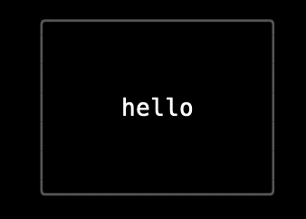
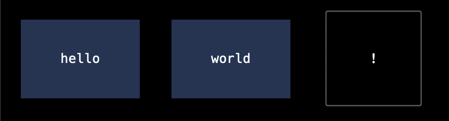
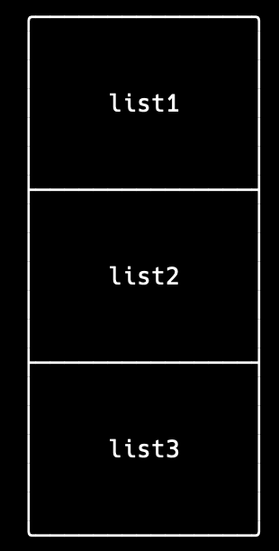
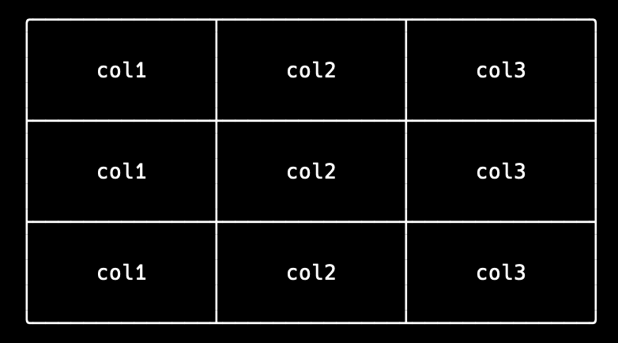

<h1 align="center">
Welcome to shellbox 👋
<br>
<a href="https://npm.im/shellbox">
  
</a>
<a href="https://npm.im/shellbox">
  
</a>
<a href="https://npm.im/shellbox">
  
</a>
</h1>

><p align="center">
create box view in shell
</p>

## Install

```sh
npm install shellbox
```

## Usage
```ts
export interface BaseStyle {
  /** view width */
  width?: number
  /** view background */
  background?: string
  /** show view border */
  border?: boolean
  /** view border color */
  borderColor?: string
  /** view border style */
  borderStyle?: keyof typeof borderMap | BorderStyle
  /** view padding */
  padding?: Padding
}
```

### View
<div align="center">
  
</div>

```ts
interface ViewOpt extends BaseStyle {
  /** text align */
  textAlign?: 'left' | 'center' | 'right'
  /** text Content(default ' ') */
  content?: string
}

View({
  content: 'hello',
  padding: [2, 5],
  border: true,
  borderStyle: 'round',
  borderColor: '#555555',
}).render()
```

### Row
<div align="center">
  
</div>

```ts
interface RowOpt extends BaseStyle {
  /** row contents,can pass a view or string */
  contents?: (ViewObj | string)[]
  /** gap between contents */
  gap?: number
  /** content style ,only for string content */
  contentStyle?: Omit<ViewOpt, 'content'>
  /** content vertical align */
  alignItems?: 'center' | 'start' | 'end'
}

Row({
  contents: [
    'hello',
    'world',
    View({
      content: '!',
      padding: [2, 5],
      border: true,
      borderStyle: 'round',
      borderColor: '#555555',
    }),
  ],
  alignItems: 'center',
  gap: 4,
  contentStyle: {
    textAlign: 'center',
    background: '#223455',
    padding: [2, 5],
  },
})?.render()
```

### List
<div align="center">
  
</div>

```ts
interface ListOpt extends BaseStyle {
  /** list contents */
  contents: string[]
  /** list direction */
  direction?: 'vertical' | 'horizontal'
  /** list text align */
  textAlign?: 'left' | 'center' | 'right'
}

List({
  contents: [
    'list1',
    'list2',
    'list3',
  ],
  direction: 'vertical',
  border: true,
  borderStyle: 'round',
  padding: [2, 5],
}).render()
```

### Table
<div align="center">
  
</div>

```ts
interface TableOpt extends BaseStyle {
  /** table data */
  data: string[][]
  /** list direction */
  direction?: 'vertical' | 'horizontal'
  /** list text align */
  textAlign?: 'left' | 'center' | 'right'
}

Table({
  data: [
    ['col1', 'col2', 'col3'],
    ['col1', 'col2', 'col3'],
    ['col1', 'col2', 'col3'],
  ],
  borderStyle: 'round',
  padding: [1, 5],
  border: true,
}).render()
```
